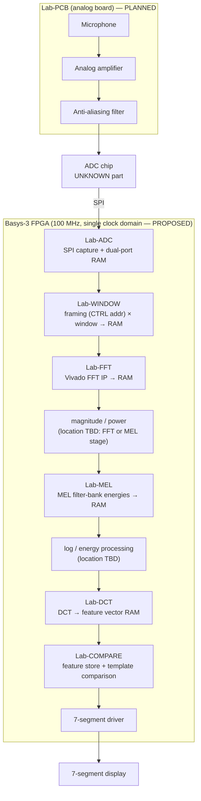
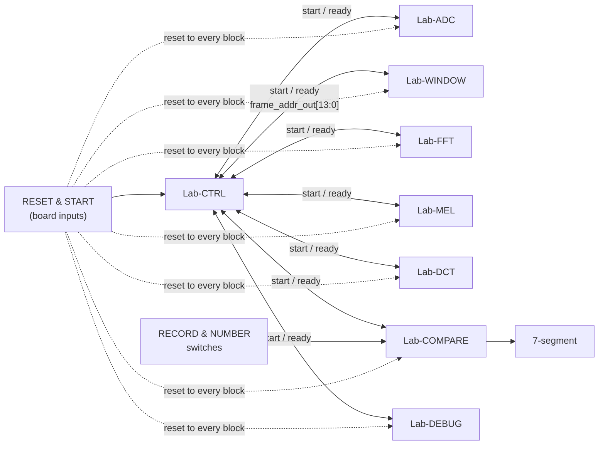
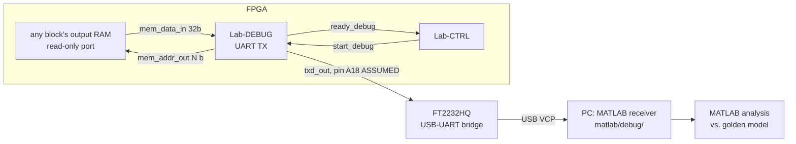
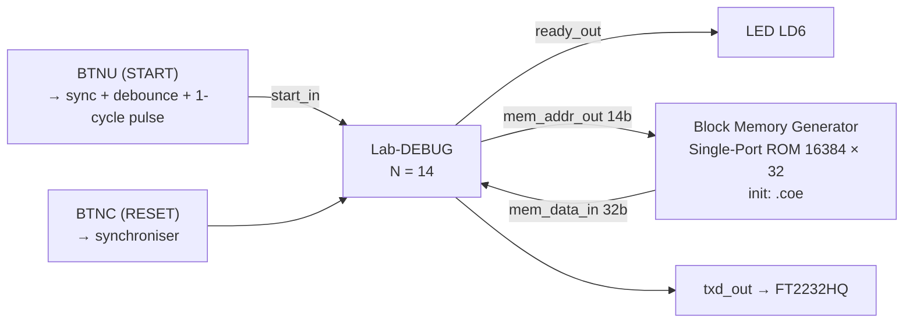
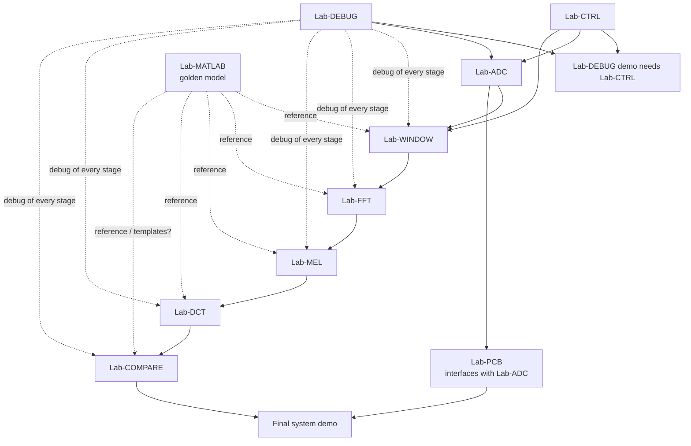

# System Architecture

Status legend: **VERIFIED / IMPLEMENTED — NOT VERIFIED / PLANNED / ASSUMED / UNKNOWN**.
At the time of writing **every block is PLANNED**; nothing is implemented.

Sources: syllabus (Lab Assignments table), Lab-CTRL manual §1 block diagram, Lab-DEBUG manual §1.
Blocks belonging to un-released stages are shown for context only; their internals are UNKNOWN
until their manuals are released.

## 1. Signal-processing chain (functional path)



Notes
- The syllabus assigns *magnitude/power* and *log* steps to no specific lab. Their placement is
  **UNKNOWN** and will be decided when the FFT/MEL manuals are released (tracked in `ASSUMPTIONS.md`).
- Each lab block owns an **output dual-port RAM** (REQ-IF-004): port A written by the block,
  port B read by the next block (and by Lab-DEBUG when attached).

## 2. Control topology (from Lab-CTRL manual)



- Handshake: single-cycle `start` pulse in, `ready` out (low while busy). See `INTERFACES.md` §2.
- Lab-CTRL generates the 50 %-overlapped frame start addresses (REQ-CTRL-002/003).
- The RECORD & NUMBER switches appear in the Lab-CTRL block diagram as inputs to Lab-COMPARE;
  their behaviour is **UNKNOWN** until the COMPARE manual is released (presumably template recording
  vs. recognition — ASSUMPTION-012).

## 3. Debug path (designed in from the start)



Debug frame on the wire (REQ-DEBUG-005..008):

```text
| 55 AA CC 03 | W0[31:24] W0[23:16] W0[15:8] W0[7:0] | W1 ... | W(2^N-1) | AA 55 03 CC |
   start word          word 0 (MSB byte first — derived)                       end word
each byte: start bit, 8 data bits LSB first, stop bit (8N1)
```

**Separation of debug vs. functional path (PROPOSED, DEC-009):**
Lab-DEBUG is a *tap*: it only reads a RAM's read port. When a block's RAM port B is shared between the
next functional block and Lab-DEBUG, a port-B address multiplexer selects the reader, and Lab-CTRL
guarantees that Lab-DEBUG only runs while the functional pipeline is idle. Final mechanism to be decided
at the Lab-ADC stage (first real dual-port RAM).

## 4. Lab-DEBUG demo configuration (current stage — PLANNED)

TA Q-04: Lab-CTRL is **not** needed for this demo; the top module drives `start_in` / `ready_out` directly.



Resource note: a 16384 × 32 ROM = 524 288 bits ≈ **16 BRAM36** (≈ 32 % of the 50 BRAM36 of an
XC7A35T — ASSUMED part). Acceptable for the demo; the final system's BRAM budget must be tracked
(see risk R-07 in `PROJECT_STATUS.md`).

## 5. Clock and reset (PROPOSED — DEC-006, DEC-007)

| Topic | Proposal | Status |
|---|---|---|
| Clock | Single 100 MHz domain (`clock_in`, Basys-3 oscillator). Slower rates (UART baud, SPI SCLK) produced with **clock enables**, never with derived logic clocks. | PROPOSED |
| Reset | Active-high `reset_in`, synchronised to `clock_in` (2-FF), used **synchronously** in all processes. | PROPOSED |
| Push-buttons / switches | 2-FF synchroniser → debounce → rising-edge detector (1-cycle pulse). | PROPOSED |

## 6. Dependency graph (stages)



Critical path (schedule): DEBUG → CTRL → ADC → WINDOW → FFT → MEL → DCT → COMPARE → final demo.
PCB (difficulty 5, 20 final-demo points) runs in parallel and needs manufacturing lead time.

## 7. What is intentionally NOT defined yet

Sampling rate, ADC part and resolution, frame length, number of frames, window function, FFT size,
MEL filter count, log implementation, DCT coefficient count, classifier method, template storage,
7-segment protocol. See `ASSUMPTIONS.md` §2 ("Unknown parameters register").
