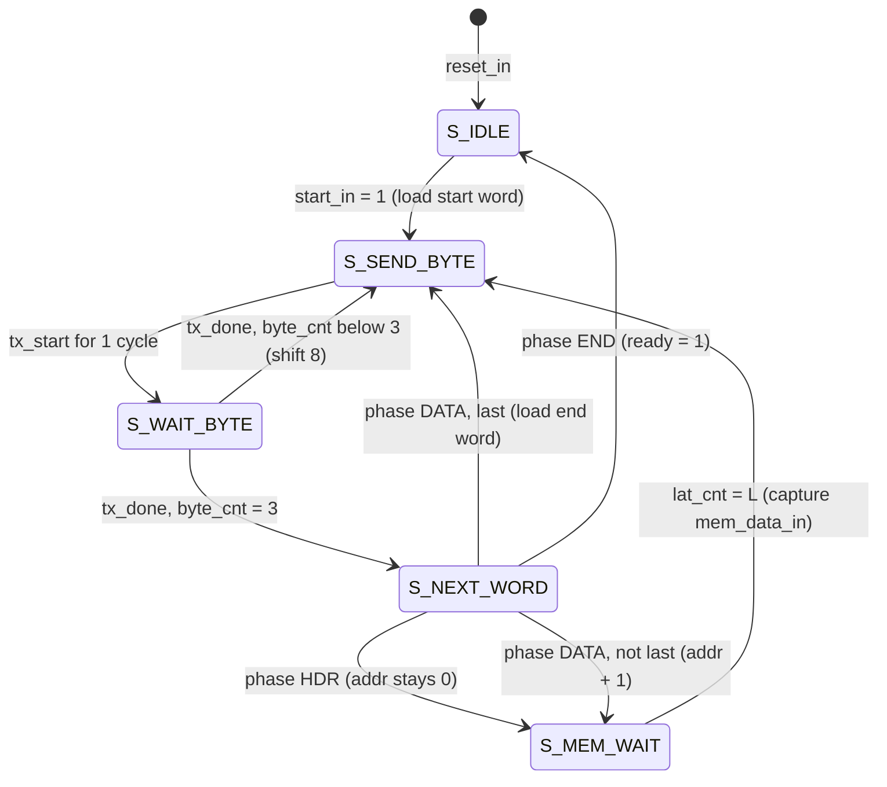

# Lab-DEBUG — Subsystem Design Document

```text
Owner:        Hande (coordinator, DEBUG RTL)      Reviewer: Eren, Ömer
Stage / manual: Lab-DEBUG — docs/manuals/Lab-DEBUG_Assignment.pdf (DBG)
Status:       DRAFT (v0.1, 2026-09-26) — to be REVIEWED before any RTL is written
Requirements: REQ-DEBUG-001…020, REQ-IF-001…003, REQ-IF-005…007, REQ-PERF-001/002, REQ-VER-002
AI-assisted:  yes — Claude Opus 5.5 (claude.ai chat, 2026-09-26); AI-0004 (review: AI-0005)
```

Sources used: `REQUIREMENTS.md` §1.2, `INTERFACES.md` §1–3 and §6, `DECISIONS.md` (DEC-005/006/007/010/011/012/018),
`TEST_PLAN.md` §1–3, `ASSUMPTIONS.md` (006–009, 011), TA answers Q-02…Q-07 (`docs/meetings/INSTRUCTOR_QUESTIONS.md`).
Items marked **DESIGN CHOICE** are decided in this document and need reviewer approval; items marked
**TO VERIFY** are open until a test or datasheet confirms them.

## 1. Purpose

Lab-DEBUG is a transmit-only UART that reads 2^N 32-bit words from the read-only port of any on-chip
memory and streams them to MATLAB through the Basys-3 FT2232HQ USB-UART bridge, framed by a start word
(`0x55AACC03`) and an end word (`0xAA5503CC`). It is the observation tool for every later lab
(REQ-DEBUG-018), so its interface must stay stable once released.

Scope boundaries:

- Inside Lab-DEBUG: word/frame FSM, address counter, memory-latency handling, UART byte transmitter.
- **Not** inside Lab-DEBUG (belongs to the demo top level, owner Eren): button synchroniser/debounce/
  one-pulse for `start_in`, reset synchroniser (DEC-007), the ROM IP, pin constraints.

## 2. Inputs

| Port | Width | Type/format | Description |
|---|---|---|---|
| `clock_in` | 1 | std_logic | 100 MHz Basys-3 oscillator (REQ-IF-005) |
| `reset_in` | 1 | std_logic, active high | Synchronous reset of all registers; already synchronised in the top level (DEC-007) |
| `start_in` | 1 | std_logic, active high | Single-cycle pulse; starts one transfer **only** when idle (REQ-DEBUG-013, REQ-IF-007) |
| `mem_data_in` | 32 | std_logic_vector(31 downto 0) | Data from the memory read port; raw 32-bit container, no numeric meaning (INTERFACES §6) |

## 3. Outputs

| Port | Width | Type/format | Description |
|---|---|---|---|
| `mem_addr_out` | N | std_logic_vector(N-1 downto 0), unsigned | Read address, registered, held stable while a word is being sent |
| `txd_out` | 1 | std_logic | UART serial output, 8N1, idle = '1' (REQ-DEBUG-008) |
| `ready_out` | 1 | std_logic, active high | '1' = idle, '0' = transfer in progress (REQ-DEBUG-014, REQ-IF-006); registered |

Generics (DEC-012, INTERFACES §3.2):

| Generic | Default | Purpose |
|---|---|---|
| `N` | 14 | Address width → 2^N words. Declared first, named literally `N`, used for every address width and counter (TA Q-07). Valid range N ≥ 1 |
| `G_CLK_FREQ_HZ` | 100_000_000 | Clock frequency |
| `G_BAUD_RATE` | 1_000_000 | Baud rate (DEC-005); simulation overrides it to shorten run-time |
| `G_MEM_LATENCY` | 2 | Clock cycles from address register update to valid `mem_data_in`. See §12 for why 2 is the safe default |

Derived constant: `C_CLKS_PER_BIT = (G_CLK_FREQ_HZ + G_BAUD_RATE/2) / G_BAUD_RATE` (rounded; = 100 for
the hardware configuration, 0 % error). An `assert C_CLKS_PER_BIT >= 4` guards against simulation settings
that are too fast for the FSM overhead.

## 4. Clock

Single clock domain, `clock_in` = 100 MHz (DEC-006). The bit timing is generated by a counter inside
`uart_tx` (clock-enable style); no derived clocks, no PLL/MMCM. Timing closure at 100 MHz is trivial for
this logic (small counters and a 32-bit shift register) — confirm WNS > 0 after implementation.

## 5. Reset

- `reset_in`: active high, **synchronous** in every clocked process (DEC-007). Synchronisation of the
  board button (BTNC, U18) is done in the top level, not here.
- Reset state: FSM = `S_IDLE`, `ready_out` = '1' (REQ-IF-006), `txd_out` = '1' (line idle),
  `mem_addr_out` = 0, UART transmitter idle.
- Reset during a transfer aborts it immediately. The PC then receives a short/truncated stream, which the
  MATLAB receiver must report as an error (fixed-length read with timeout, DEC-010 / REQ-SW-003). The next
  `start_in` produces a complete, correct frame (TB-DEBUG-06, HW-DEBUG-05).
- If `reset_in` and `start_in` are high in the same cycle, reset wins.

## 6. Algorithm

```text
on start_in = '1' while idle:
    ready_out <= '0'
    send_word(0x55AACC03)                       -- REQ-DEBUG-005
    for k in 0 .. 2^N - 1:                      -- REQ-DEBUG-004
        mem_addr_out <= k
        wait G_MEM_LATENCY cycles               -- REQ-DEBUG-019
        send_word(mem_data_in)
    send_word(0xAA5503CC)                       -- REQ-DEBUG-006
    ready_out <= '1'

send_word(w):  for byte in [w(31:24), w(23:16), w(15:8), w(7:0)]:   -- MSB byte first (REQ-DEBUG-007, TA Q-02)
                   uart_send(byte)              -- 8N1, LSB bit first (REQ-DEBUG-008)
```

The payload is sent unchanged even if it contains the delimiter values; the PC relies on the fixed
length `8 + 4·2^N` bytes, not on searching for the end word (DEC-010, TB-DEBUG-08).

## 7. Internal architecture (block diagram)

Two entities, one per file (CONTRIBUTING §6):

| File | Entity | Content |
|---|---|---|
| `fpga/rtl/debug/uart_tx.vhd` | `uart_tx` | One-byte 8N1 transmitter with internal bit-period counter |
| `fpga/rtl/debug/debug.vhd` | `debug` | Lab-DEBUG top: word/frame FSM, address counter, latency wait, instantiates `uart_tx` |

```text
                        debug (Lab-DEBUG)
            +-----------------------------------------------------------+
 start_in ->|                                                           |
 reset_in ->|   +-----------------------------+        +-------------+  |
 clock_in ->|   |  word / frame FSM           |tx_start|  uart_tx    |  |-> txd_out
            |   |  - phase: HDR / DATA / END  |------->|             |  |
            |   |  - byte_cnt  (0..3)         |tx_data |  shift_reg  |  |
            |   |  - lat_cnt   (0..L)         |==8===> |  clk_cnt    |  |
            |   |  - word_reg  (32-bit shift) |tx_done |  bit_cnt    |  |
            |   |  - addr_reg  (N-bit)        |<-------|             |  |
            |   +-----------------------------+        +-------------+  |
            |        |  ready_reg        ^  mem_data_in (32)            |
            +--------|-------------------|------------------------------+
                     v                   |
  ready_out <--------+     mem_addr_out (N) --> [ memory read port ] --+
                                              (ROM IP in the demo, any RAM port-B later)
```

Internal signals between the FSM and `uart_tx` (DESIGN CHOICE):

| Signal | Dir (FSM view) | Description |
|---|---|---|
| `tx_start` | out | '1' for exactly one cycle while FSM is in `S_SEND_BYTE`; `uart_tx` accepts it only when idle |
| `tx_data` | out | `word_reg(31 downto 24)` — the most significant byte of the shift register |
| `tx_done` | in | One-cycle pulse from `uart_tx` after the stop bit has lasted a full bit period |

## 8. State machine (diagram + state table)

One clocked process, enumerated state type, explicit `when others => state <= S_IDLE` (CONTRIBUTING §6).
A separate `phase` register (HDR / DATA / END) avoids three copies of the byte-sending states.



| State | Outputs / actions | Exit condition → next state |
|---|---|---|
| `S_IDLE` | `ready_reg` = '1'; `tx_start` = '0'; `start_in` is only looked at here (REQ-IF-007) | `start_in` = '1': load start word, `byte_cnt` ← 0, `addr_reg` ← 0, `phase` ← HDR, `ready_reg` ← '0' → `S_SEND_BYTE` |
| `S_SEND_BYTE` | `tx_start` = '1', `tx_data` = `word_reg(31:24)` (one cycle) | always → `S_WAIT_BYTE` |
| `S_WAIT_BYTE` | wait for the UART | `tx_done` and `byte_cnt` /= 3: `word_reg` ← `word_reg(23:0) & x"00"`, `byte_cnt` + 1 → `S_SEND_BYTE`; `tx_done` and `byte_cnt` = 3 → `S_NEXT_WORD` |
| `S_NEXT_WORD` | decide what the next word is; `byte_cnt` ← 0, `lat_cnt` ← 0 | HDR: `phase` ← DATA → `S_MEM_WAIT` · DATA, addr ≠ last: `addr_reg` + 1 → `S_MEM_WAIT` · DATA, addr = last: load end word, `phase` ← END → `S_SEND_BYTE` · END: `ready_reg` ← '1' → `S_IDLE` |
| `S_MEM_WAIT` | hold `addr_reg`; count `lat_cnt` | `lat_cnt` = `G_MEM_LATENCY`: `word_reg` ← `mem_data_in` → `S_SEND_BYTE`; else `lat_cnt` + 1 |

"Last address" is detected as `addr_reg = (others => '1')`, so the address counter never needs N+1 bits
and never leaves the range 0 … 2^N−1 (TB-DEBUG-04). After the transfer the address stays at 2^N−1 until
the next start (DESIGN CHOICE — harmless, the memory is read-only).

`uart_tx` internal FSM (DESIGN CHOICE): two states, `IDLE` / `SENDING`, a 10-bit shift register loaded
with `'1' & data & '0'` (stop, data, start), a `clk_cnt` 0 … `C_CLKS_PER_BIT`−1 and a `bit_cnt` 0 … 9.
`txd_out` is a register (glitch-free line). `busy` is not exported to the FSM; the FSM only issues
`tx_start` after `tx_done`, so the transmitter is always idle when a start arrives.

## 9. Timing (waveform sketch, cycle counts)

Notation: C = `C_CLKS_PER_BIT` (100 in hardware), L = `G_MEM_LATENCY`. Cycle counts are the **design
intent** and are measured in simulation (TB-DEBUG-02, TB-UART-02/03) — TO VERIFY.

Handshake (REQ-DEBUG-013/014, INTERFACES §2):

```text
clock_in   _|‾|_|‾|_|‾|_|‾|_|‾|_ ... _|‾|_|‾|_|‾|_
start_in   __|‾‾‾|__________________________________    sampled '1' at edge E_s
ready_out  ‾‾‾‾‾‾|_____________________ ... ___|‾‾‾‾‾   '0' right after E_s; '1' two edges after the last stop bit ends
txd_out    ‾‾‾‾‾‾‾‾|__start__|b0|b1|...                 start bit of byte 0x55 begins one edge after E_s
```

- `ready_out` falls at the **same edge that samples `start_in` = '1'**, i.e. one clock after `start_in`
  rose. This matches the manual waveform and TB-DEBUG-02. INTERFACES §2 had a wrong wording ("first
  rising edge after the edge that sampled start"); it was aligned with this document in review
  (CORR-0002).
- One UART byte: start bit + 8 data bits + stop bit, each exactly C clocks → 10·C clocks on the line.
- Gap between bytes of the same word: the FSM needs 2 extra clocks (`tx_done` → `S_SEND_BYTE` →
  accepted), so the stop bit is effectively C + 2 clocks long. Stop bit ≥ 1 bit period is guaranteed
  (TB-UART-03).
- Gap between data words: L + 2 extra clocks (`S_NEXT_WORD`, address update, L-cycle wait).

Memory read timing (L = 1 shown; the address is held constant for the whole word):

```text
edge          D+1            D+2             D+3
S_NEXT_WORD → addr_reg <= k  S_MEM_WAIT      S_MEM_WAIT: lat_cnt = 1 = L → word_reg <= mem_data_in
BRAM (L=1)                   samples addr k  mem_data_in = M[k] valid after D+2 → captured at D+3 ✔
BRAM (L=2)                   samples addr k  output reg loads at D+3 → valid after D+3 → captured at D+4 (lat_cnt = 2) ✔
```

## 10. Data format

| Field | Bytes on the wire, in order |
|---|---|
| Start word | `0x55`, `0xAA`, `0xCC`, `0x03` |
| Data word k (k = 0 … 2^N−1, from address k) | `W[31:24]`, `W[23:16]`, `W[15:8]`, `W[7:0]` |
| End word | `0xAA`, `0x55`, `0x03`, `0xCC` |

Each byte: start bit '0', D0 … D7 (LSB first), stop bit '1', no parity (8N1). Total bytes per transfer
`8 + 4·2^N` (N = 14 → 65 544 bytes). Words narrower than 32 bits are zero-padded in the MSBs by the
**producer** (REQ-DEBUG-020); Lab-DEBUG does not interpret the data.

## 11. Fixed-point representation

Not applicable — Lab-DEBUG moves bytes and does no arithmetic on data. `mem_data_in` is a raw 32-bit
container and `mem_addr_out` an unsigned N-bit counter; both are already registered in INTERFACES §6.
No update needed there.

## 12. Memory requirements

Lab-DEBUG itself contains **no memory** (registers only). The demo memory lives in the top level:

| Item | Value | Status |
|---|---|---|
| Demo ROM | Block Memory Generator, Single Port ROM, 2^14 × 32 bit (512 Kbit), always enabled, COE-initialised | REQ-DEBUG-016 |
| BRAM usage | 16 × RAMB36 of 50 on XC7A35T (32 %) — expected, read the IP summary | TO VERIFY |
| Read latency | **2 cycles** — IP `debug_rom` is built with the primitive output register ON (`fpga/ip/create_debug_rom.tcl`); 1 cycle would apply without it | VERIFIED 2026-09-26 (TB-ROM-01, ASSUMPTION-011) → `G_MEM_LATENCY` = 2 is exact |

**Why `G_MEM_LATENCY` defaults to 2:** because `addr_reg` is held constant during `S_MEM_WAIT`,
waiting *longer* than the real latency is always safe (the data simply stays valid), while waiting
*shorter* captures the previous word — the classic "shifted by one" bug. The cost of one extra cycle per
word is 16 384 cycles ≈ 0.16 ms per transfer, negligible. Set the generic to the value from the IP summary
anyway and record it here; TB-DEBUG-07 runs L = 1 and L = 2.

Integration note for later labs: the memory enable (`ena`/`enb`) must be tied to '1' or kept high while
Lab-DEBUG is reading, otherwise the output does not update.

## 13. Latency

| Event | Cycles (design intent) |
|---|---|
| `start_in` sampled → `ready_out` = '0' | 0 (same edge) |
| `start_in` sampled → first start bit on `txd_out` | 1 |
| Last stop bit finished → `ready_out` = '1' | 2 |
| Address update → data captured | L + 1 |

## 14. Throughput

Total clocks per transfer ≈ `(8 + 4·2^N)·(10·C + 2) + 2^N·(L + 2)`.

| Configuration | Clocks | Time |
|---|---|---|
| Hardware: N = 14, C = 100, L = 2 | ≈ 65 544·1 002 + 16 384·4 ≈ 65.74 M | ≈ 0.657 s |
| Simulation: N = 3, C = 10, L = 2 | ≈ 40·102 + 8·4 = 4 112 | ≈ 41 µs |

Line utilisation ≈ 1000 / 1002 = 99.8 % of the raw 1 Mbaud rate. No flow control: the FT2232HQ buffer
and the PC must keep up — ASSUMPTION-009, verified in HW-DEBUG-01/03.

## 15. Interface protocol

- **start/ready:** as INTERFACES §2 and §9 above. `start_in` pulses during a transfer are ignored because
  `start_in` is only evaluated in `S_IDLE` (REQ-IF-007, TB-DEBUG-05). `start_in` must be a one-cycle
  pulse: a level still high when the FSM returns to `S_IDLE` would start a second transfer. Producing
  the pulse is the job of the top-level button conditioning (Eren).
- **Memory read port:** Lab-DEBUG drives `mem_addr_out` and samples `mem_data_in` L cycles later
  (§9). It never writes. While a transfer is running it owns the read port; sharing that port with the
  next functional block is decided at Lab-ADC (DEC-009).
- **UART:** FPGA `txd_out` → pin A18 → FT2232HQ RXD (REQ-DEBUG-010; pin from INTERFACES §1.1, still to be
  checked against `Basys3_Master.xdc`).

## 16. Resource estimate

Estimate before synthesis — replace with post-synthesis numbers.

| Resource | Estimate | Basis |
|---|---|---|
| FF | ≈ 70–90 | addr N=14, word_reg 32, byte/lat/phase/state ≈ 8, ready 1; uart: shift 10, clk_cnt 7, bit_cnt 4, misc 3 |
| LUT | < 100 | counters, comparators, byte mux |
| BRAM | 0 (DEBUG) + 16 RAMB36 (demo ROM) | §12 |
| DSP | 0 | no arithmetic |

## 17. Verification method

Testbench infrastructure (TEST_PLAN §1): behavioural UART receiver model in `fpga/tb/common/` that
samples `txd_out` in the middle of each bit and checks start/stop bits; a memory model with a generic
latency L returning a known pattern; self-checking output `Expected / Actual / PASS|FAIL` and a final
`TB_RESULT` line (DEC-011). Simulation uses N = 3 and C = 10 except TB-UART-02 (real C = 100).

| ID | File | What it proves | REQ |
|---|---|---|---|
| TB-UART-01…03 | `fpga/tb/debug/tb_uart_tx.vhd` | 8N1 framing, LSB first, exact bit period (100 clocks), back-to-back bytes | DEBUG-008/009, PERF-001 |
| TB-DEBUG-01…09 | `fpga/tb/debug/tb_debug.vhd` | reset state, handshake timing, full frame, address order, start while busy, reset mid-transfer, L = 1/2, delimiter values in payload, two consecutive transfers | DEBUG-004…007/012…014/019, IF-006/007 |
| TB-TOPDBG-01 | Eren's top-level TB | button pulse → one frame; ROM content = COE | DEBUG-016 |
| MT-DEBUG-01…04 | MATLAB (Ömer) | decode, delimiter-in-payload, error on short stream, COE round trip | DEBUG-015, SW-003 |
| HW-DEBUG-01…05 | Basys-3 | terminal bring-up at 1 Mbaud, full ROM dump 0 mismatches, 10× repeat ≈ 0.66 s, button abuse, reset mid-transfer | DEBUG-008…017, PERF-002 |

Demo evidence (REQ-VER-002): waveform screenshots showing `start_in`, `ready_out`, `txd_out` with at
least the start word and one data word decoded, plus the `TB_RESULT` lines.

Recommended build order (DBG §3 "build progressively"): `uart_tx` + TB-UART → HW-DEBUG-01 with a
constant byte → `debug` FSM + TB-DEBUG → demo top level + ROM.

## 18. Known limitations

- Transmit only, no flow control, no parity, fixed 8N1 (REQ-DEBUG-002).
- A transfer cannot be paused; reset is the only way to abort it.
- `start_in` must be a clean one-cycle pulse (see §15).
- **1 000 000 baud (DEC-005, ACCEPTED) is not yet verified on hardware** (ASSUMPTION-009) → HW-DEBUG-01.
  Contingency only, if the hardware link fails: set `G_BAUD_RATE` = 115 200 (C = 868, +0.006 % error)
  and re-run TB-UART-02 — no other change needed.
- The design assumes the memory output is stable while the address is unchanged (true for Block
  Memory Generator ROM/RAM read ports with enable = '1').

## 19. Change history

| Version | Date | Author | Change |
|---|---|---|---|
| 0.1 | 2026-09-26 | Hande (AI-assisted, Claude Opus 5.5) | First draft for review |
| 0.2 | 2026-09-26 | Review (Eren + Claude, AI-0005) | Log ID filled in; §9 note resolved (INTERFACES §2 corrected, CORR-0002); §18 baud wording aligned with DEC-005 |
