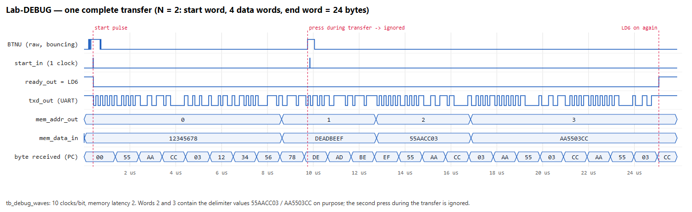
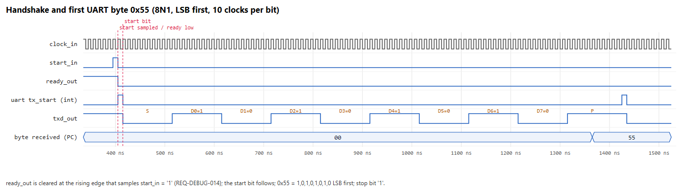
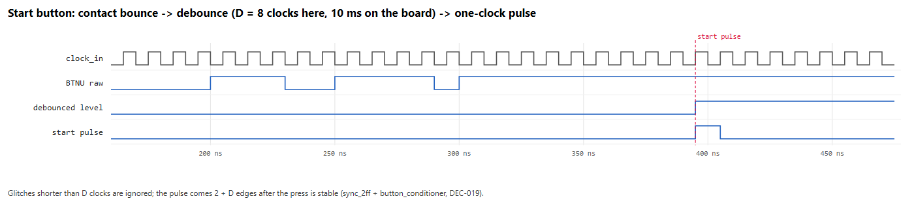
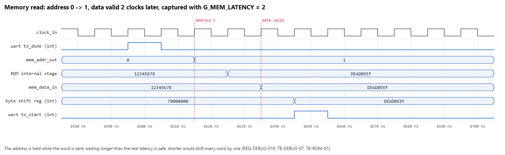
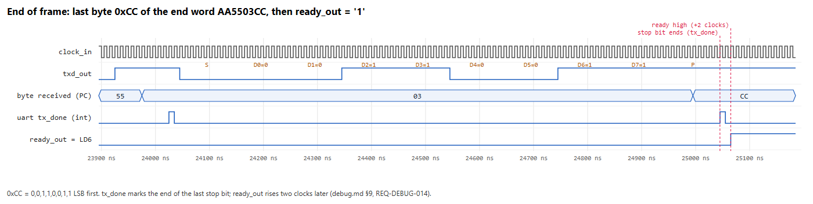

# Lab-DEBUG — Demonstration Guide (Wed Sep 30, 2026)

One page to run the demo, then the material to show. Everything here is already verified
(simulation, synthesis, hardware) — the demo repeats it in front of the assistant.

## 1. Demo card (≈ 10 minutes)

| # | Manual item (DBG §2) | What we show | Who (proposal) | Evidence |
|---|---|---|---|---|
| 1 | "Show that your design is implemented on FPGA" | Vivado: implementation summary (WNS +5.083 ns, 128 LUT, 114 FF, 14.5 BRAM, DRC 0) → Hardware Manager → program `top_debug_demo.bit` → **LD6 on** | Eren | [synthesis report](../../verification/2026-09-26_top_debug_demo_synth.md) |
| 2 | "Present your test bench simulation results … start, ready, UART transmit signals, transactions" | Figures W1–W5 below (or live: XSim GUI, §4) + the `TB_RESULT` lines of all testbenches | Hande | §3, [simulation/results](../../../simulation/results/) |
| 3 | "Demo design … Lab-DEBUG … and a ROM (Block Memory Generator, 14-bit address, 32-bit data, COE), N = 14" | Top level: BTNU → debounce → `debug` (N = 14) → `debug_rom` IP; IP settings (Single-Port ROM, 16384 × 32, latency 2) and the COE file. **Lab-CTRL is not required** (TA Q-04) | Ömer (ROM/COE), Eren (top) | [top_debug_demo.md](../../architecture/subsystems/top_debug_demo.md), `fpga/ip/create_debug_rom.tcl` |
| 4 | "Configure your FPGA … transfer the ROM content to MATLAB. Verify the results on MATLAB." | MATLAB: `r = run_debug_demo("COMx")` → press **BTNU once** → `PASS: 16384/16384 words match`; show `r.words(1:6)` next to the COE | Ömer | [HW-DEBUG report](../../verification/2026-09-26_HW-DEBUG.md) |

**Rule during the demo: press BTNU only while LD6 is on.** A press right after a transfer starts a new
(correct) transfer — this made two of our test sessions look like failures.

## 2. Before the demo (checklist)

- [ ] Laptop with Vivado 2025.2, MATLAB, FTDI driver (Eren's PC is verified); **data** micro-USB cable; Basys-3.
- [ ] Repository clone at an ASCII path (e.g. `C:\dev\...`) — Vivado cannot use `...\Masaüstü\...` (DEC-014).
- [ ] Bitstream ready: `fpga/vivado/build/debug_demo/top_debug_demo.bit` (rebuild: `vivado -mode batch -source fpga/vivado/build_debug_demo.tcl`, ≈ 2 min).
- [ ] Board plugged in → Device Manager shows "USB Serial Port (COMx)"; note the number.
- [ ] Dry run once: program → LD6 on → `run_debug_demo("COMx")` → BTNU → PASS.
- [ ] Open in advance: this guide, the five figures, `simulation/results/`, the synthesis report, `fpga/ip/debug_rom.coe`.
- [ ] If the lab PC is used instead: FTDI driver + COM port + one `run_debug_demo` (REQ-HW-003 — not yet tested there).

## 3. Simulation results to present

### 3.1 Testbench summary (all self-checking, `Expected / Actual / PASS|FAIL`, DEC-011)

| Testbench | Scope | Result | Log |
|---|---|---|---|
| `tb_uart_tx` | 8N1 byte, LSB first, 100 clocks/bit (1 Mbaud), back-to-back | **PASS 37/37** | [log](../../../simulation/results/2026-09-26_tb_uart_tx.log) |
| `tb_debug` | handshake, full frame, address order, start while busy, reset mid-transfer, latency 1/2, delimiter values in payload | **PASS 97/97** | [log](../../../simulation/results/2026-09-26_tb_debug.log) |
| `tb_debug_rom` | ROM IP latency = 2, all 16 384 words = COE | **PASS 11/11** | [log](../../../simulation/results/2026-09-26_tb_debug_rom.log) |
| `tb_button_conditioner` | bounce, glitches, hold, reset, latency 2 + D | **PASS 22/22** | [log](../../../simulation/results/2026-09-26_tb_button_conditioner.log) |
| `tb_top_debug_demo` | full top with the real ROM IP, N = 14: two frames = COE, hold/bounce/press-while-busy | **PASS 15/15** | [log](../../../simulation/results/2026-09-26_tb_top_debug_demo.log) |
| MATLAB `test_debug` | decode, delimiters in payload, short/corrupt stream, COE round trip | **PASS 15/15** | [log](../../../simulation/results/2026-09-26_mt_debug.log) |
| Hardware session | 10 repeats, hold, press during transfer, reset during transfer | **PASS 14/14** | [log](../../verification/2026-09-26_hw_debug_session.log) |

Mutation checks (the testbenches catch real bugs), logged: 3 injected bugs in `button_conditioner` and
`G_MEM_LATENCY = 1` in the top-level test (every word shifted) — all detected (headers of the logs above).
Reported by the AI in AI-0004 but **not logged in the repository**: 3 bugs in `uart_tx`, 7 in `debug` —
do not present these as evidence unless re-run.

### 3.2 Waveforms (from `tb_debug_waves`: N = 2 so one frame fits; 10 clocks/bit; memory latency 2)

**W1 — one complete transfer.** Start word, 4 data words (two of them equal to the delimiters on purpose),
end word; a press during the transfer is ignored; LD6 comes back on at the end.



**W2 — handshake and first byte 0x55.** `ready_out` is cleared at the edge that samples `start_in`; then the
start bit and the data bits LSB first (1,0,1,0,1,0,1,0), stop bit.



**W3 — start button.** Contact bounce is ignored; one clean one-clock pulse after the press is stable.



**W4 — memory read.** Address 0 → 1; data valid two clocks later (ROM latency 2); captured into the byte
shift register; the next byte transmission starts.



**W5 — end of frame.** Last byte 0xCC of the end word, `tx_done` at the end of the stop bit, `ready_out` high
two clocks later.



## 4. Showing waveforms live (optional)

From the repository root (ASCII path, Vivado `bin` on `PATH`):

```text
vivado -mode batch -source fpga/vivado/sim_debug_waves.tcl -tclargs gui
```

Opens XSim with the demo signals already added (hex radix for the buses) and runs the simulation. Zoom into
the first 1.5 µs for the handshake. Without `-tclargs gui` the script regenerates the VCD and the five figures
(`simulation/tools/make_debug_waveforms.py`).

## 5. Likely questions (everyone should be able to answer)

| Question | Short answer |
|---|---|
| Why does `ready_out` go low exactly there? | It is a register cleared at the rising edge that samples `start_in = '1'` (manual waveform; W2). |
| What if `start_in` comes during a transfer? | Ignored: the FSM only looks at `start_in` in `S_IDLE` (REQ-IF-007; W1, HW-DEBUG-04). |
| How is a 32-bit word sent? | Four UART bytes, most-significant byte first, like the header 55 AA CC 03 (TA Q-02). Each byte 8N1, LSB first. |
| How do you handle the ROM latency? | The address is held; `debug` waits `G_MEM_LATENCY` = 2 clocks, measured on the IP (TB-ROM-01; W4). Waiting longer is safe, shorter shifts every word by one — our mutation test shows exactly that. |
| What if the data contains 55AACC03 or AA5503CC? | MATLAB reads a fixed length `8 + 4·2^N` bytes and only *checks* the start/end words (DEC-010). Our COE has them at addresses 1, 2, 16382, 16383. |
| Why 1 Mbaud? | Team decision (DEC-005): ≥ 115 200 required; 100 MHz / 1 MHz = 100 exactly (0 % error); 0.66 s instead of 5.7 s per dump; verified on hardware. |
| Where is N defined? | Generic `N` at the top of `debug.vhd`, default 14 (TA Q-07). Changing N: new COE, regenerate the IP, re-run the tests. |
| Why the debounce? | A mechanical button bounces for a few ms; without it a held/released button could start a second transfer (DEC-019; W3, TB-BTN, HW-DEBUG-04). |
| Reset behaviour? | BTNC → 2-FF synchroniser → synchronous reset; aborts a transfer; MATLAB reports a short frame; next press gives a clean frame (HW-DEBUG-05). |
| Timing / resources? | WNS +5.083 ns at 100 MHz; 128 LUT, 114 FF, 14.5 BRAM (ROM 16 384 × 32). |
| Did you use AI? | Yes — every AI session is logged in `ai/` (AI-0001 … AI-0013) with our reviews and corrections (CORR-0001/0002). |

## 6. If something goes wrong

| Symptom | Action |
|---|---|
| LD6 off after programming | Program again; press BTNC once. |
| MATLAB times out, LD6 blinks on BTNU | COM port wrong or held by another program → `serialportlist("available")`, close other terminals, retry. |
| MATLAB: "Start word is …" | A press after the transfer started another frame → run `run_debug_demo` again and press once. |
| Bitstream missing / Vivado path error | Clone to `C:\dev\...`, run `fpga/vivado/build_debug_demo.tcl` (≈ 2 min). |
| Board unavailable | Show the hardware logs and the MATLAB output of 2026-09-26 (HW-DEBUG report) + simulation figures. |

## 7. After the demo

Tag `lab-debug-demo` on `main`, GitHub release with `top_debug_demo.bit`, update PROJECT_STATUS (demonstration
done), REQUIREMENTS (REQ-DEBUG-001/016/017 → VERIFIED by D), HANDOFF; Lab-CTRL kickoff Thu Oct 1.
